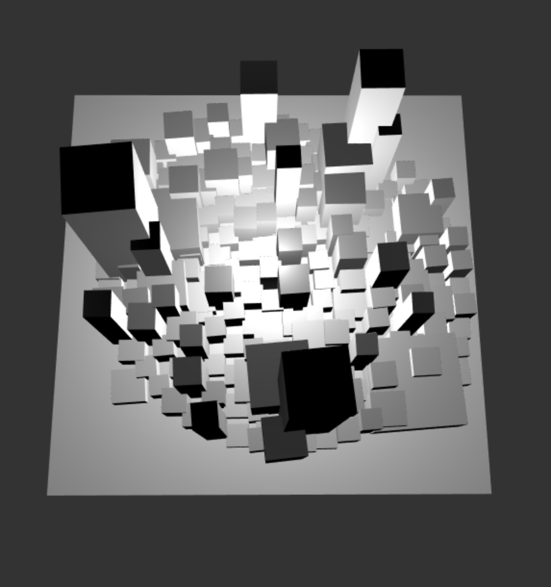
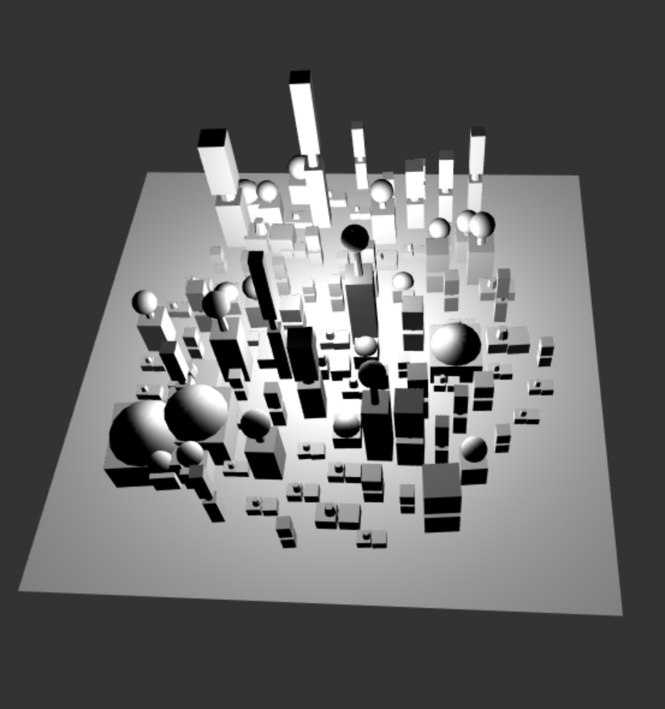
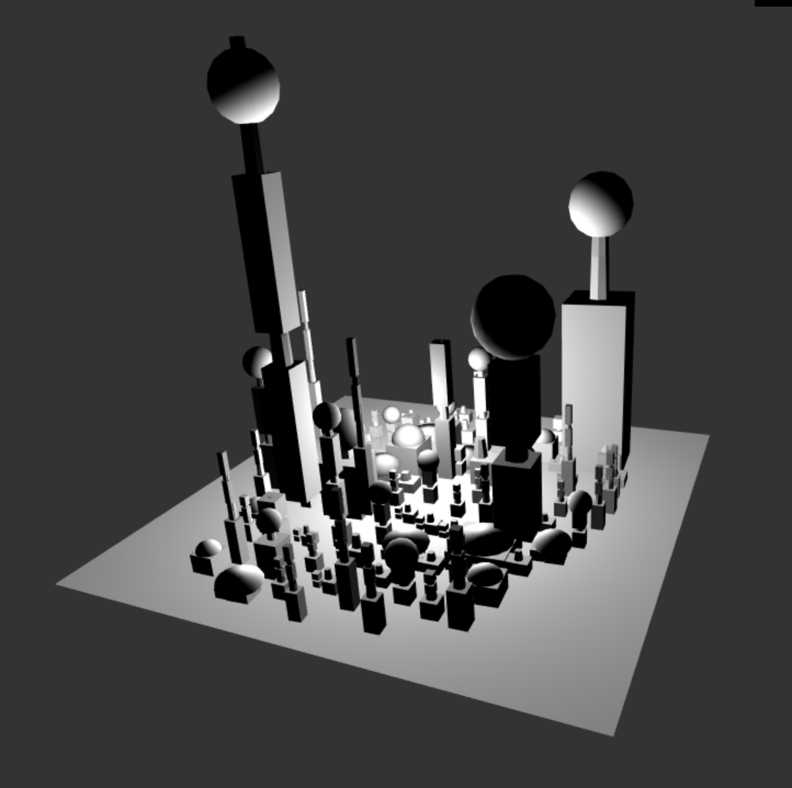
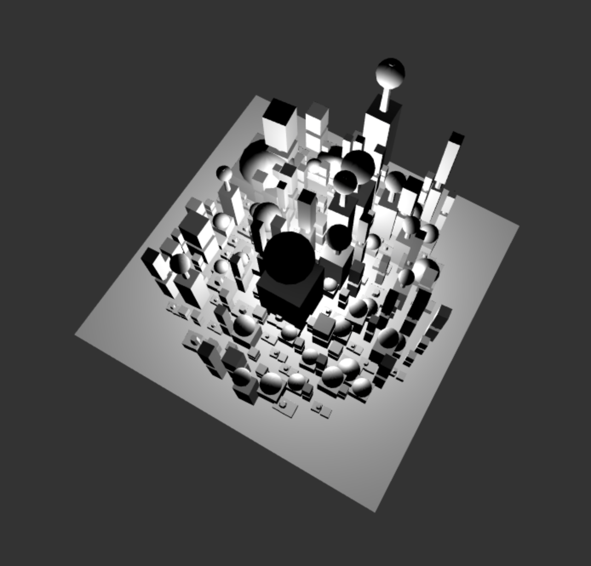

## Symbol Node Class

- The node class is implemented as Shape inside of DrawableRule.ts and stores the following fields

    - symbol:string;
    - geo:MeshDrawable;
    - position:vec3;
    -rotation:vec3;
    -scale:vec3;
    -terminal:boolean;
## Grammar Design

- Building: based on a random float, the building can either terminate or it be extended
    -  1. Termination for Tall Buildings: If a building is taller than it is wide, then it terminates in a needle ball
    -  2. Termination for Wide Buildings: If a building is wider than it is tall, then it temrinates in a dome
    -  3. Extension for Tall Buildings: If a building is taller than it is wide, then it is subdivded in the y-direction and connected with a rod
    - 4. Extension for Wide Buildings: If a building is taller than it is wide, then it is subdivded in the z-direction and connected with a rod
-  5. Top Extension: if a building is extended, then the top extension can either be extended again or it can terminate in a flower based on a random float (this can only be achieved with over 2 iterations)

All VBO calculations are handled inside the DrawableRule.ts class which is called inside the LoadScene() of main.ts

## City Design
I implemented two different distributions of buildings throughout the city: random and radial. The random method simply uses a random float to place buildings in the plane whereas the radial distribution uses Disc warping on grid samples. These can be edited using GUI.

The GUI can also edit the density of the city, which basically determines how many buildings are present.

Radial with no iterations

Radial with 1 iteration

Radial with 3 iterations

Radial with High Density (290)

Random with 2 iterations

    
# Project 5: Shape Grammar

For this assignment you'll be building directly off of the L-system code you
wrote last week.

**Goal:** to model an urban environment using a shape grammar.

**Note:** We’re well aware that a nice-looking procedural city is a lot of work for a single week. Focus on designing a nice building grammar. The city layout strategies outlined in class (the extended l-systems) are complex and not expected. We will be satisfied with something reasonably simple, just not a uniform grid!

## Symbol Node (5 points)
Modify your symbol node class to include attributes necessary for rendering, such as
- Associated geometry instance
- Position
- Scale
- Anything else you may need

## Grammar design (55 points)
- Design at least five shape grammar rules for producing procedural buildings. Your buildings should vary in geometry and decorative features (beyond just differently-scaled cubes!). At least some of your rules should create child geometry that is in some way dependent on its parent’s state. (20 points)
    - Eg. A building may be subdivided along the x, y, or z axis into two smaller buildings
    - Some of your rules must be designed to use some property about its location. (10 points)
    - Your grammar should have some element of variation so your buildings are non-deterministic.  Eg. your buildings sometimes subdivide along the x axis, and sometimes the y. (10 points)   
- Write a renderer that will interpret the results of your shape grammar parser and adds the appropriate geometry to your scene for each symbol in your set. (10 points)

## Create a city (30 points)
- Add a ground plane or some other base terrain to your scene (0 points, come on now)
- Using any strategy you’d like, procedurally generate features that demarcate your city into different areas in an interesting and plausible way (Just a uniform grid is neither interesting nor plausible). (20 points)
    - Suggestions: roads, rivers, lakes, parks, high-population density
    - Note, these features don’t have to be directly visible, like high-population density, but they should somehow be visible in the appearance or arrangement of your buildings. Eg. High population density is more likely to generate taller buildings
- Generate buildings throughout your city, using information about your city’s features. Color your buildings with a method that uses some aspect of its state. Eg. Color buildings by height, by population density, by number of rules used to generate it. (5 points)
- Document your grammar rules and general approach in the readme. (5 points)
- ???
- Profit.

## Make it interesting (10)
Experiment! Make your city a work of art.

## Warnings:
If you're not careful with how many draw calls you make in a single `tick()`,
you can very easily blow up your CPU with this assignment. As with the L-system,
try to group geometry into one VBO so the run-time of your program outside of
the time spent generating the city is fast.

## Suggestions for the overachievers:
Go for a very high level of decorative detail!
Place buildings with a strategy such that buildings have doors and windows that are always accessible.
Generate buildings with coherent interiors
If dividing your city into lots, generate odd-shaped lots and create building meshes that match their shape .i.e. rather than working with cubes, extrude upwards from the building footprints you find to generate a starting mesh to subdivide rather than starting with platonic geometry.
